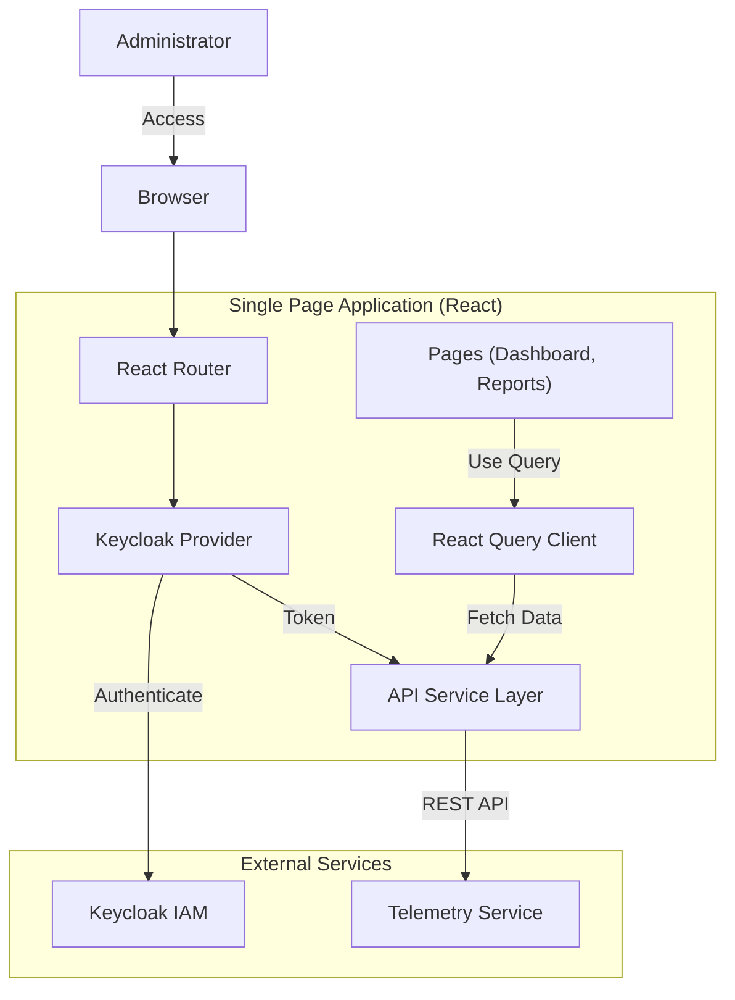

# oan-telemetry-dashboard-app Technical Documentation

## 1. System Overview

**oan-telemetry-dashboard-app** is the administrative frontend for the Vistaar ecosystem. It visualizes telemetry data, providing insights into user engagement, system health, and AI interaction quality. It allows administrators to view metrics like questions asked, active users, session details, and user feedback.

### Primary Objective
To provide an intuitive, secure, and responsive dashboard for monitoring and analyzing the performance and usage of the Vistaar platform.

---

## 2. Architecture & Design

The application extends the standard **Vite + React** architecture with **Keycloak** for robust security.

### Design Patterns
-   **Compound Components**: UI elements are built using Headless UI primitives (Radix UI) via **Shadcn UI**.
-   **Context Providers**: Global state is managed via Contexts (`ThemeContext`, `DateFilterContext`) to avoid prop drilling.
-   **Data Fetching Hooks**: Uses **TanStock Query (React Query)** for server state management, caching, and background refetching.
-   **Protected Routes**: Authentication is enforced at the route level using a Keycloak wrapper.

### Architecture Diagram



### Data Flow
1.  **Authentication**: User logs in via Keycloak. `App.tsx` waits for `keycloak.initialized`.
2.  **Routing**: `App.tsx` routes the user to the requested page (e.g., `/sessions`).
3.  **Data Request**: The page component (e.g., `SessionsReport.tsx`) calls a custom hook or uses `useQuery` with a fetcher from `src/services/api.ts`.
4.  **API Call**: `api.ts` appends the Keycloak Bearer token to headers and calls the backend.
5.  **Rendering**: Data is displayed in tables (`TanStack Table`) or charts (`Recharts`).

---

## 3. Module/Component Breakdown

### Core Directories
-   `src/pages/`: Main views (Dashboard, UsersReport, Analytics).
-   `src/components/`: Reusable widgets (Layout, DateRangePicker) and UI primitives (`ui/`).
-   `src/services/`: API interaction logic (`api.ts`).
-   `src/contexts/`: Shared state.

### Key Components

| Component / File | Responsibility | Interactions |
| :--- | :--- | :--- |
| **`App.tsx`** | Root component, Routing, Auth Check. | Wraps app in Providers (`QueryClient`, `ThemeProvider`). |
| **`api.ts`** | API Client. Defines interfaces and fetch functions. | Used by pages to fetch data. Mocks data if needed. |
| **`Layout.tsx`** | Common page structure (Sidebar, Header). | Wraps every page content. |
| **`Dashboard.tsx`** | Landing page with high-level summary cards. | Fetches aggregate stats via `api.fetchStats`. |
| **`DateFilterContext.tsx`** | Manages the global date range selection. | Consumed by almost all reports to filter data. |

---

## 4. Key Logic & Algorithms

### Authentication Flow
The app uses `@react-keycloak/web` to integrate with Keycloak.
1.  On load, it checks for an existing session.
2.  If unauthenticated, it does *not* render the routes, effectively blocking access.
3.  On API calls, the `token` is retrieved from the Keycloak instance and added to the `Authorization` header.

### Data Visualization
Charts are implemented using **Recharts**.
-   **Data Transformation**: Raw API data (often time-series) is transformed in `api.ts` or the page component to match Recharts' data format (arrays of objects).

### Global Date Filtering
A unique feature is the global date filter.
-   **Context**: `DateFilterProvider` holds `startDate` and `endDate`.
-   **Usage**: When the user changes dates in the top bar, the Context values update.
-   **Refetching**: Since `api.ts` functions depend on these context values (passed as params), React Query automatically refetches the active queries when the filter changes.

---

## 5. API/Interface Reference

The frontend consumes the Backend API documented in `oan-telemetry-dashboard-service`.
Key interface methods in `api.ts`:

*   `fetchDevices(params)`: Get device usage stats.
*   `fetchUsers(params)`: Get user list with engagement metrics.
*   `fetchSessions(params)`: Get session history.
*   `fetchQuestions(params)`: Get Q&A logs.
*   `fetchHealthStatus(url)`: Ping external services for uptime checks.

---

## 6. Dependencies

| Library | Purpose |
| :--- | :--- |
| **React** | UI Framework. |
| **Vite** | Build tool. |
| **TypeScript** | Type safety. |
| **Recharts** | Charting library. |
| **Shadcn UI** | UI Component library (Tabs, Cards, Tables). |
| **React Query** | Data fetching and caching. |
| **Keycloak JS** | IAM Client. |
| **React Router** | Navigation. |
| **Tailwind CSS** | Styling. |

---

## 7. Setup & Usage

### Prerequisites
*   Node.js (v18+)
*   Running instance of Keycloak (or configured mock)
*   Running instance of `oan-telemetry-dashboard-service`

### Installation
1.  Navigate to the directory:
    ```bash
    cd oan-telemetry-dashboard-app
    ```
2.  Install dependencies:
    ```bash
    npm install
    # or
    bun install
    ```

### Configuration
Create/Edit `.env` (or `.env.local`).
-   `VITE_API_URL`: URL of the telemetry service.
-   `VITE_KEYCLOAK_URL`, `VITE_KEYCLOAK_REALM`, `VITE_KEYCLOAK_CLIENT_ID`: Auth config.

### Running the App
*   **Development**:
    ```bash
    npm run dev
    ```
    Access at `http://localhost:5173`.

*   **Production Build**:
    ```bash
    npm run build
    npx serve dist
    ```
